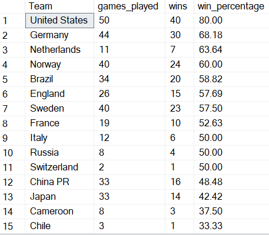

# FIFA Women's World Cup with MSSQL

## Introduction

As we approach the 2023 FIFA Women's World Cup, I decided to explore the Women's world cup games with MSSQL just like I had done for the Men's World Cup in November last year. For the women's world cup, I used SQL to answer the following questions:

1. How many countries have hosted the tournament?
2. How many wins does each country have in the competition?
3. What is the win percentage for each country in the tournament?
4. How many tournaments has each country participated in?
5. What are the highest scoring games in the tournament?
6. How many goals has each country scored in the competition?
7. What are the longest winning streaks in the competition?
8. Which countries won medals at each tournament?
9. What are the most common scorelines in the competition?

This project demonstrates an understanding of the following SQL skills:

- Subqueries and Common Table Expressions (CTEs)
- Set operators
- Aggregate functions
- Data Manipulation Language (DML)
- Data Definition Languague (DDL)

   among many others.

The SQL codes for this project can be found [here](Women_world_cup_codes.sql)

## The FIFA Women's World Cup

### 1) How many countries have hosted the World Cup?

There have been 6 different countries who have hosted all 8 FIFA Women's World Cup. China PR and USA hosted half of these with 2 each while Canada, France, Germany and Sweden have hosted one each.

### 2) How many wins does each country have in the competition?

The United States have the most wins (without counting penalty shootouts) in the competition with 40. Germany come in at second place having 10 less goals.

### 3) What is the win percentage for each country in the tournament?

The U.S has a really impressive winning record at the tournament with an 80% win rate while at the other end of the table, this year's co-hosts, New Zealand would be hoping to break their duck after going 15 games without a win in the competition.

### 4) How many tournaments has each country participated in?

Brazil, Germany, Japan, Norway, Nigeria, Sweden and the United States are the only teams to have featured in every single edition of the FIFA Women's World Cup since it's inauguration in 1991.

### 5) What are the highest scoring games in the tournament?

A United States monopoly in a 13 goal thriller versus Thailand in the previous edition of the tournament set the record for the most goals scored in a FIFA Women's World Cup game

### 6) How many goals has each country scored in the competition?

Germany and the United States are the only teams to have over a 100 goals in the tournament.

### 7) What are the longest winning streaks in the competition?

This was my favourite query to figure out. Got stuck with this so many times until I Bing AI helped me get over the line 😁.

The United States broke their own record of 11 consecutive wins when they beat the Netherlands 2-0 in the 2019 final. They would be coming into this year's competition looking to extend their current record.

### 8) Which countries won medals at each tournament?

The U.S.A (again) are the only team to have won a medal at every single tournament. They also have the most gold medals with 4. Sweden on the other hand have won the most medals without actually winning the competition (1 silver 3 bronze).

### 9) What are the most common scorelines in the competition?

Finally, looking at the most common scorelines, since 1991, there have been only 8 goal-less games. The most common scoreline is a 1-0 win in favour of the designated home teams.

## Conclusion

Per the history of the tournament, I think it's safe to pick the United States as favourite to win this tournament especially now that we know they would be coming into the competition looking to be the first team to win the FIFA Women's world cup 3 times in a row. 

I hope we are treated to a good tournament in Australia/NewZealand in 2023. Thanks for reading 😄  
